## 안드로이드 : https://play.google.com/store/apps/details?id=com.rolling.jiujits
## Ios : [https://apps.apple.com/app/id6764238741](https://apps.apple.com/kr/app/%EB%A1%A4%EB%A7%81-%EC%A3%BC%EC%A7%93%EC%88%98%EC%9D%98-%EC%A0%95%EB%B3%B4%EB%A5%BC-%ED%95%9C%EB%88%88%EC%97%90/id6764238741)
---

## 서비스 소개 

Rolling은 주짓수 사용자들이 흩어진 오픈매트와 대회 정보를 탐색하고, 실제 참여와 기록, 커뮤니티 활동까지 하나의 흐름 안에서 이어갈 수 있도록 만든 서비스입니다.
기존에는 오픈매트 공지와 대회 정보가 인스타그램, 단체 채팅방, 외부 사이트 등 여러 채널에 분산되어 있어 필요한 정보를 제때 찾기 어려웠고, 참여 이후의 기록과 커뮤니티 활동도 별도로 관리해야 하는 불편함이 있었습니다.
Rolling은 오픈매트와 대회 정보를 지역과 일정 기준으로 통합 조회할 수 있도록 구성하고, 오픈매트 신청과 관리, 커뮤니티 소통, 훈련일지 작성과 인사이트 확인까지 하나의 서비스 안에서 연결되도록 설계했습니다.
또한 운영자는 별도의 관리자 페이지에서 공지, 문의, 신고, 대회 데이터, 사용자 제재를 관리할 수 있도록 구성해 실제 운영까지 고려한 구조로 만들었습니다

---

## 운영 성과 및 시스템 지표
- 초기 시장 검증: 명확한 타겟층인 주짓수 수련자를 대상으로 출시 3주 만에 누적 다운로드 300회를 돌파했습니다.
- 데이터 파이프라인 자동화: Spring Scheduler 기반 크롤링 파이프라인을 구축해 수작업 없이 월평균 10~20건의 신규 대회 데이터를 자동으로 동기화했습니다.
- 안정적인 서비스 운영: `Nginx`, `Prometheus`, `Grafana` 기반 모니터링 환경을 구축하고, 최근 30일 기준 일평균 약 1,300건의 API 요청을 처리했으며 대회 목록 API의 p95 응답시간을 약 12ms 수준으로 유지했습니다.

---

## 팀 / 역할

| 이름 | 역할 |
| --- | --- |
| 정원철 | 1인 개발로 서비스 기획, Flutter 앱 개발, React 랜딩/관리자 웹 개발, Spring 백엔드 API 개발, 데이터베이스 설계, 배포/모니터링 구조 설계까지 전 과정을 직접 수행 |

---

## 🛠 기술 스택 (Tech Stack)

| 구분 | 사용 기술 |
| :--- | :--- |
| **📱 Frontend** |      |
| **⚙️ Backend** |      |
| **🗄️ Database** |   |
| **☁️ Infra & DevOps** |     |
| **📈 Monitoring** |     |
| **🔗 API & Auth** |      |

---

## 시스템 아키텍처
* 이미지를 클릭하면 원본 화면으로 이동하거나 확대하여 볼 수 있습니다.*

[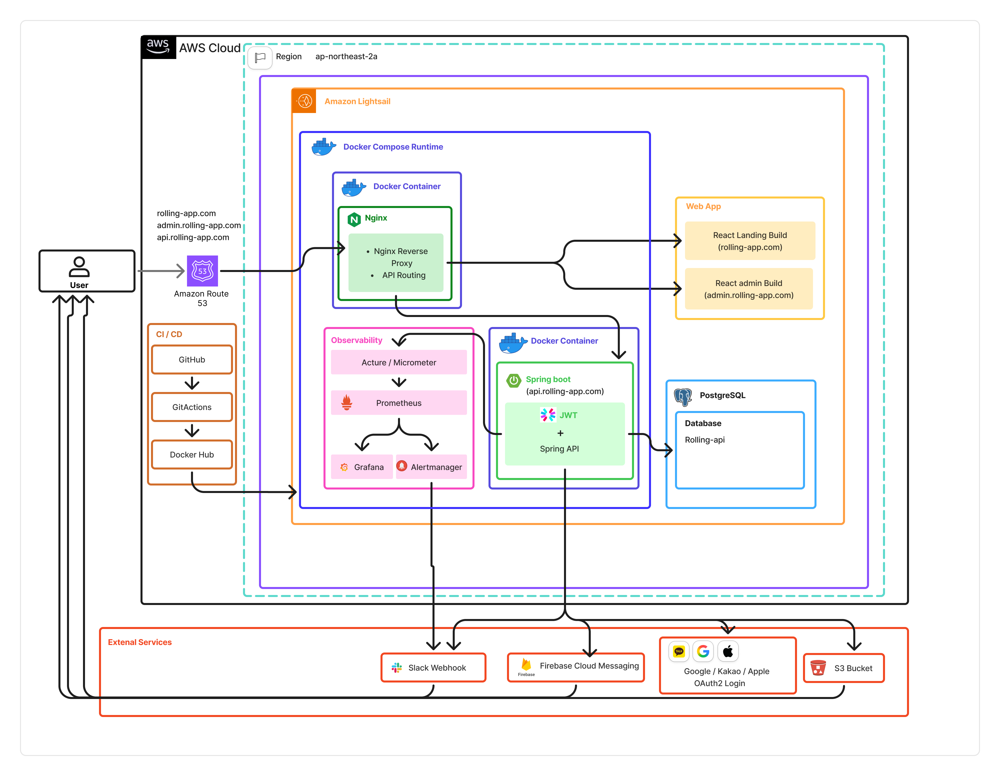](images/architecture/롤링_아키텍처_다이어그램.png)

---

## ERD
* 이미지를 클릭하면 원본 화면으로 이동하거나 확대하여 볼 수 있습니다.*
[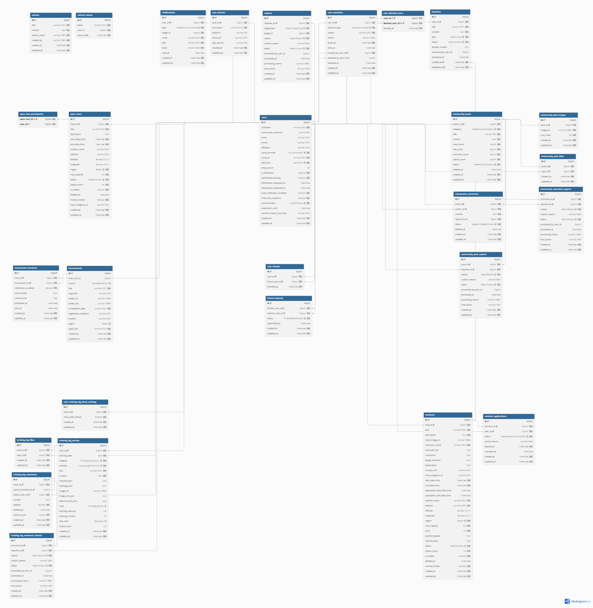](images/00514users/Rolling_ERD.png)

---

## 문제 정의

- 주짓수 오픈매트와 대회 정보가 SNS, 단체 채팅방, 외부 사이트 등 여러 채널에 흩어져 있어 필요한 정보를 한곳에서 확인하기 어려웠습니다.
- 지역과 일정 기준으로 참여 가능한 오픈매트와 대회를 빠르게 탐색하기 어려워 사용자 탐색 비용이 컸습니다.
- 정보 탐색 이후 참가 신청, 일정 확인, 알림 확인, 문의 처리까지의 흐름이 분리되어 있어 실제 참여 행동으로 자연스럽게 이어지기 어려웠습니다.
- 훈련 기록, 출석 관리, 인사이트 확인, 사용자 간 소통 기능이 분리되어 있어 활동 기록과 커뮤니티 경험이 하나의 서비스 안에서 연결되지 않았습니다.
- 서비스가 확장되면서 사용자 기능뿐 아니라 공지, 문의, 신고, 사용자 제재, 대회 데이터 관리, 운영 모니터링까지 함께 다룰 수 있는 구조가 필요했습니다.

---

## 해결 방식

- 오픈매트와 대회 정보를 하나의 서비스 안에서 통합 조회할 수 있도록 구성해 분산된 탐색 경로를 줄였습니다.
- 지역, 일정, 상태 기준의 필터링과 정렬 기능을 제공해 사용자가 원하는 활동 정보를 더 빠르게 찾을 수 있도록 설계했습니다.
- 각 대회 단체의 웹사이트에서 대회 정보를 수집하는 크롤러를 구현하고, 스케줄링을 통해 데이터를 주기적으로 동기화하도록 구성해 수작업 없이 최신 정보를 반영할 수 있도록 자동화했습니다.
- 오픈매트 신청과 관리, 공지 확인, 알림, 문의 기능을 함께 제공해 탐색 이후의 참여 흐름이 서비스 안에서 이어지도록 구성했습니다.
- 커뮤니티 기능과 훈련일지 기능을 추가해 사용자가 기록을 남기고, 활동을 돌아보고, 다른 사용자와 상호작용할 수 있도록 확장했습니다.
- 사용자 앱과 관리자 웹을 분리해 공지, 문의, 신고, 대회 데이터, 사용자 제재를 운영 관점에서 관리할 수 있도록 구성했습니다.
- `Nginx`, `Docker Compose`, `Prometheus`, `Grafana`, `Slack Webhook`, `Actuator` 기반의 배포 및 모니터링 체계를 도입해 실제 운영과 장애 대응까지 고려한 구조로 설계했습니다.

---

## 트러블슈팅

### 1. 오픈매트 신청 시 정원 초과가 발생할 수 있는 동시성 문제
- 문제: 정원이 1명 남은 오픈매트에 여러 사용자가 동시에 신청하면 중복 승인으로 인해 정원 초과가 발생할 수 있었습니다.
- 원인: 단순 조회 후 신청하는 구조만으로는 동시에 들어온 요청 간 정합성을 보장하기 어려웠고, 정원 경계 상황에서 동일 오픈매트에 대한 동시 접근을 안전하게 제어할 수 없었습니다.
- 해결: 신청 API에 `PESSIMISTIC_WRITE` 락을 적용해 동일 오픈매트에 대한 요청을 직렬화하고, 정원 검증과 상태 변경을 하나의 트랜잭션 안에서 처리하도록 구성했습니다. 이후 멀티스레드 통합 테스트를 추가해 동시 요청 상황에서도 1건만 성공하는지 검증했습니다.
- 검증: 정원 1명인 오픈매트에 대해 2개의 동시 신청 요청을 발생시키는 통합 테스트를 작성했고, 1건만 성공하고 나머지 1건은 `OPEN_MAT_CLOSED` 또는 `CAPACITY_FULL`로 실패하는 것을 확인했습니다. 최종 참가자 수는 1명으로 유지되었고, 오픈매트 상태도 `CLOSED`로 일관되게 전이되었습니다.
- 결과: 정원 경계 상황의 경쟁 요청에서도 성공 1건, 실패 1건, 최종 참가자 수 1명을 보장하도록 만들어 데이터 정합성을 안정적으로 유지할 수 있었습니다.

### 2. 인증/인가 경계가 불명확한 다중 API 환경의 보안 문제
- 문제: 공개 API, 사용자 API, 관리자 API, Actuator 엔드포인트가 함께 존재하는 구조에서 권한 검증이 일관되지 않으면 보안 누락이나 과도한 차단이 발생할 수 있었습니다.
- 원인: 단순히 인증 여부만 확인하는 방식으로는 관리자 전용 기능, 운영 엔드포인트, 제재 계정에 대한 세밀한 접근 제어를 분리하기 어려웠습니다.
- 해결: Spring Security 기반으로 보안 필터 체인을 분리하고, JWT 인증 이후 `UserPrincipal`에 사용자 권한과 계정 상태를 반영하도록 구성했습니다. 또한 제재된 사용자는 일부 경로만 접근할 수 있도록 별도 필터를 적용하고, 공개/인증/관리자/운영 경계를 통합 테스트로 검증했습니다.
- 검증: 공개 조회 엔드포인트, 계정 기반 액션, 관리자 API, Actuator 보호 경로, CORS preflight, request tracking header 동작까지 통합 테스트로 확인했습니다.
- 결과: 공개 API 접근성은 유지하면서도 관리자 및 운영 경로는 권한에 따라 분리해 다중 API 환경의 인증/인가 경계를 일관되게 통제할 수 있었습니다.

### 3. 관리자 조회 API에서의 N+1 문제와 집계 데이터 조회 성능 저하
- 문제: 관리자 목록 조회 시 작성자, 신고자 등 연관 엔티티와 참가자 수 같은 집계 데이터를 함께 조회하면서 쿼리가 반복 실행될 수 있는 성능 이슈가 있었습니다.
- 원인: 연관 엔티티의 LAZY 로딩으로 인해 목록 크기만큼 추가 쿼리가 발생할 수 있었고, 집계 정보도 별도 최적화 없이 조회하면 전체 응답 성능이 저하될 수 있었습니다.
- 해결: `@EntityGraph`를 활용해 필요한 연관 엔티티 조회를 명시적으로 제어하고, 집계 데이터는 별도 최적화 쿼리로 분리했습니다. 또한 Hibernate statistics 기반 테스트를 작성해 쿼리 수와 지연 로딩 발생 여부를 수치로 검증했습니다.
- 검증: 관리자 조회 경로별 prepared statement 수를 검증한 결과, 오픈매트 목록 조회는 최대 5개, 문의 목록 조회는 최대 2개, 신고 목록 조회는 최대 3개의 쿼리로 통제되었고, `EntityFetchCount`와 `CollectionFetchCount`는 모두 0으로 확인되었습니다.
- 결과: 조회 건수에 비례해 추가 쿼리가 증가하는 N+1 문제를 방지하고, 관리자 조회 API의 쿼리 수를 예측 가능한 수준으로 통제할 수 있었습니다.

### 4. 프로덕션 환경의 백그라운드 작업 및 운영 장애 감지 한계
- 문제: 상태 동기화, 대회 크롤링, 탈퇴 처리 배치 같은 백그라운드 작업이 실패해도 사용자의 제보 이전에는 관리자가 즉시 인지하기 어려웠습니다.
- 원인: 작업별 실행 상태와 실패 이력을 일관되게 수집하고 추적할 수 있는 운영 관측 체계가 부족했습니다.
- 해결: `ScheduledTaskTracker`를 도입해 작업의 시작, 성공, 실패 상태를 추적하고, 이를 Spring Actuator, Prometheus, Grafana, Slack Webhook과 연동해 health check, 커스텀 메트릭, 운영 알림 체계를 구성했습니다. 대회 크롤링은 각 크롤러를 개별적으로 예외 처리해 특정 사이트 수집이 실패해도 전체 배치가 중단되지 않도록 했고, 스케줄러 실패 시 운영 알림이 발송되도록 구성했습니다.
- 검증: 스케줄러 성공/실패가 `rolling_scheduler_execution_total` 메트릭으로 각각 1건씩 기록되는 테스트를 추가했고, 최근 실행 상태에 따라 scheduler health가 `UP` 또는 `DOWN`으로 반영되는 것도 확인했습니다. 또한 대회 크롤링 스케줄러는 예외 발생 시에도 배치 메서드가 중단되지 않고 실패 상태를 기록하도록 검증했습니다.
- 결과: 배치 작업의 최근 실행 상태와 실패 여부를 수치와 상태값으로 추적할 수 있게 되었고, 크롤링/스케줄러 장애 발생 시 운영자가 더 빠르게 감지하고 대응할 수 있는 구조를 마련했습니다.

---

## 프로젝트 구조

### Frontend

- Flutter 앱과 React 관리자 웹을 분리해 사용자 기능과 운영 기능을 구분
- MVVM 기반 화면 구성
- GetX를 이용한 상태 관리, 의존성 주입, 라우팅

### Backend

- Spring Boot 기반 REST API 서버
- JWT 인증과 Spring Security를 활용한 인증/인가 분리
- 오픈매트, 대회, 커뮤니티, 훈련일지 등 도메인 중심 API 설계
- 사용자용 API와 관리자용 운영 API를 분리해 권한 경계를 명확히 구성
- 스케줄러, 푸시 알림, 크롤링, 운영 정책을 포함한 서비스 구조 설계
- Actuator, Prometheus, Grafana, Slack Webhook 기반 모니터링 및 장애 대응 체계 구성
- Flyway 기반 데이터베이스 스키마 버전 관리 및 운영 반영 자동화

## API / 도메인 구성

**핵심 비즈니스 (Core Business)**
- **오픈매트(OpenMat):** 오픈매트 생성, 수정, 삭제, 목록 및 상세 조회, 참가 신청 및 취소, 내가 신청한 목록 조회, 내가 개최한 오픈매트 관리, 모집 상태 변경, 참가자 관리 기능을 담당합니다.
- **대회(Tournament):** 대회 목록 및 상세 조회, 지역 기반 탐색, 즐겨찾기와 리마인더 설정, 수동 등록/수정/삭제 기능을 제공하며, 각 대회 단체 웹사이트를 대상으로 한 크롤링과 스케줄러 기반 자동 수집 기능을 포함합니다.

**커뮤니티 및 기록 (Social & Log)**
- **커뮤니티(Community):** 게시글 작성, 수정, 삭제, 목록 및 상세 조회, 댓글, 좋아요, 신고 기능 등 사용자 간 소통 기능을 제공합니다.
- **훈련일지(TrainingLog):** 훈련 기록 작성 및 관리, 출석 잔디, 기간별 인사이트, 친구 관계, 친구 기록 열람, 좋아요, 댓글, 공유 설정 등 기록 기반 소셜 기능을 제공합니다.

**인증 및 사용자 (Auth & User)**
- **인증(Auth):** 소셜 로그인, 액세스 토큰/리프레시 토큰 발급 및 갱신, 로그아웃, 회원 탈퇴 예약 및 자동 처리 배치 등 사용자 인증 흐름을 담당합니다.
- **사용자(User):** 내 정보 조회 및 수정, 푸시 알림 설정, FCM 토큰 등록 및 삭제, 사용자 차단 및 차단 목록 조회 기능을 제공합니다.

**운영 및 시스템 (Admin & System)**
- **관리자(Admin):** 공지 운영, 문의 응답, 신고 처리, 대회 데이터 관리, 크롤링 실행, 사용자 제재 관리, 운영 상태 확인 기능을 담당합니다.
- **알림(Notification):** 사용자 알림 목록 조회, 읽음 처리, 배지 확인 기능을 담당하며 오픈매트, 세미나, 커뮤니티, 훈련일지, 문의 답변 등 이벤트 기반 알림을 관리합니다.
- **공지/문의/신고:** 일반 사용자 대상 공지사항 조회 및 문의/신고 등록 기능을 제공하며, 관리자용 등록, 수정, 삭제, 상태 변경, 누적 제재 관리 기능을 포함합니다.
- **지도(Map):** 주소 기반 좌표 변환과 위치 검색을 위한 지도 API 연동 기능을 제공합니다.

## 주요 화면

썸네일을 클릭하면 더 큰 이미지로 이동합니다.

| 로그인 | 메인 페이지 | 오픈매트 목록 |
| :---: | :---: | :---: |
| <a href="./docs/screenshots.md#user-login">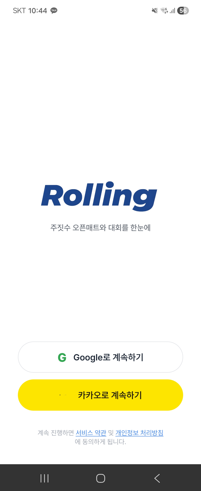</a> | <a href="./docs/screenshots.md#user-main-page">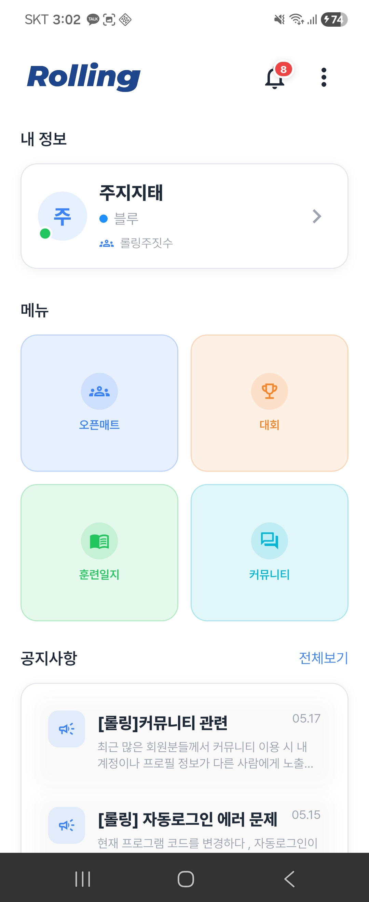</a> | <a href="./docs/screenshots.md#user-openmat-list">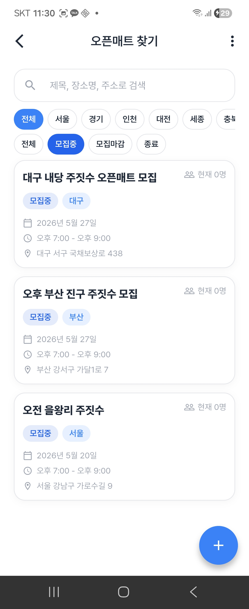</a> |

| 오픈매트 신청 | 대회 목록 | 대회 상세 |
| :---: | :---: | :---: |
| <a href="./docs/screenshots.md#user-openmat-sign-up">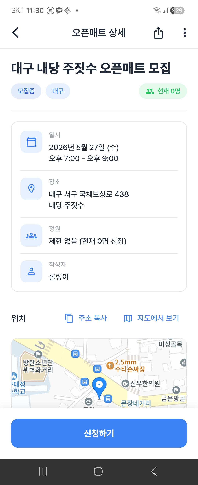</a> | <a href="./docs/screenshots.md#user-tournaments-list">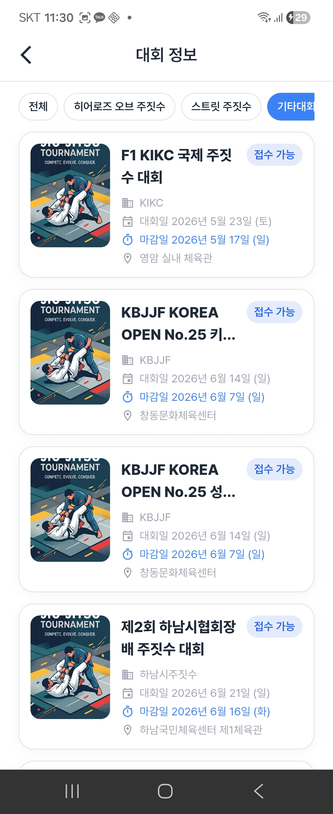</a> |  |

| 알림 목록 | 커뮤니티 목록 | 커뮤니티 상세 |
| :---: | :---: | :---: |
| <a href="./docs/screenshots.md#user-notifications">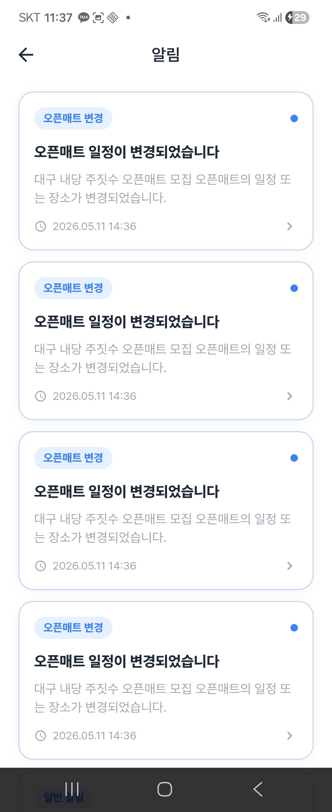</a> | <a href="./docs/screenshots.md#user-community-list">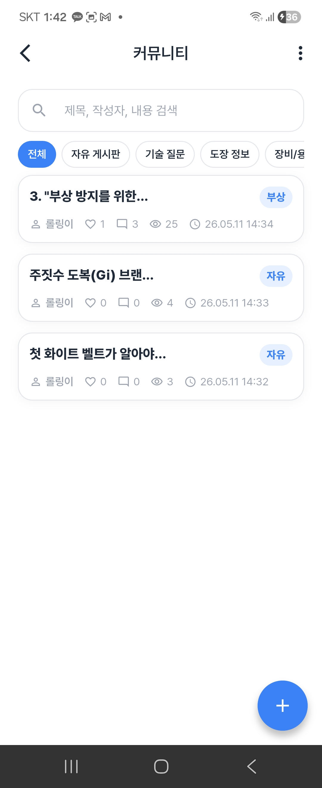</a> | <a href="./docs/screenshots.md#user-community-detail">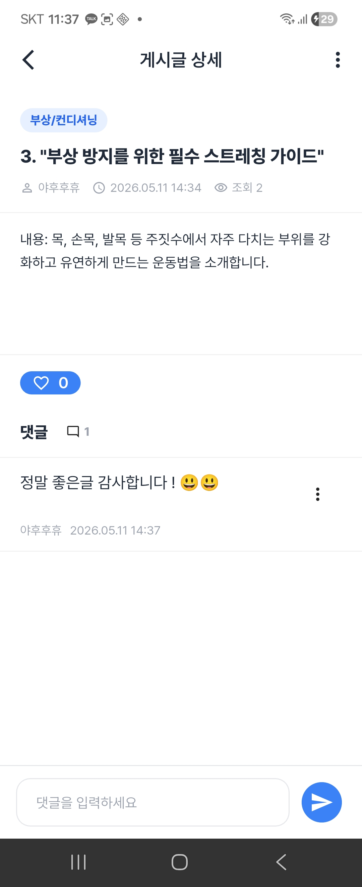</a> |

| 훈련일지 메인 | 훈련일지 작성 | 훈련일지 상세 |
| :---: | :---: | :---: |
| <a href="./docs/screenshots.md#user-training-log-main">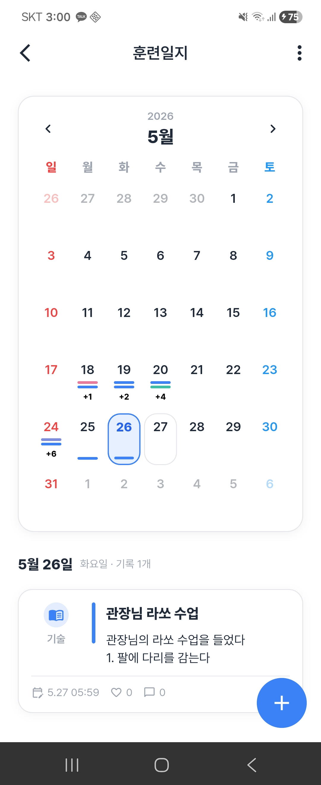</a> | <a href="./docs/screenshots.md#user-training-log-create">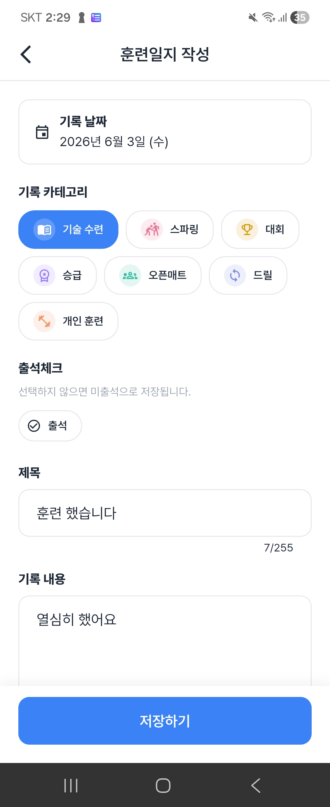</a> | <a href="./docs/screenshots.md#user-training-log-detail">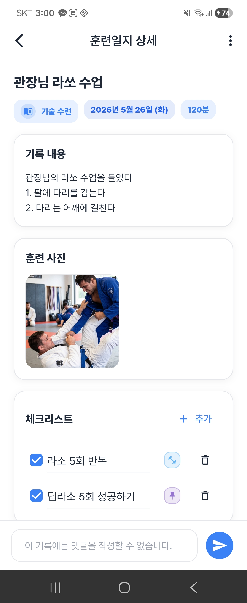</a> |

| 친구 훈련일지 댓글달기 |  |  |
| :---: | :---: | :---: |
|  |  |  |

###  관리자 웹 (Admin)

| 관리자 기능 | 화면 |
| :--- | :--- |
| **메인 대시보드** |  |
| **대회 운영** |  |
| **대회 수동 등록** |  |
| **대회 운영 크롤링 실행** |  |
| **공지사항 관리** |  |
| **공지사항 작성** |  |
| **문의 관리** |  |
| **문의 답변** |  |
| **신고 관리** |  |
