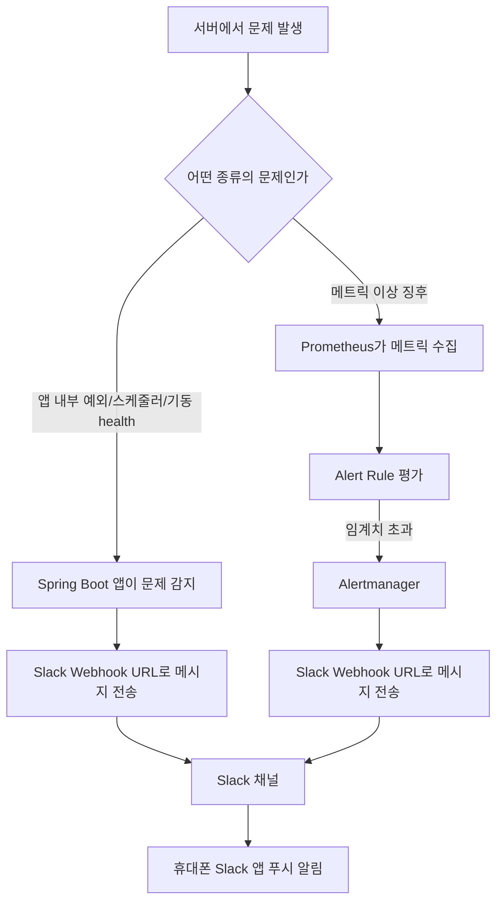
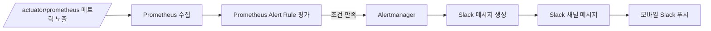

# Slack Webhook 운영 가이드 (처음 보는 기준)

## 이 문서의 목적

이 문서는 현재 `rolling-api`에 구현된 Slack webhook 알림이 어떻게 동작하는지, 운영자가 무엇을 이해해야 하는지, 실제로 어떤 상황에서 휴대폰으로 알림을 받게 되는지를 쉽게 설명하기 위한 문서다.

기존 기획서가 설계 중심이라면, 이 문서는 `개념 이해 + 운영 흐름 이해`에 초점을 둔다.

## 먼저 이해해야 하는 핵심

Slack webhook은 `우리 서버가 Slack 채널로 메시지를 보내는 주소`다.

즉 구조는 아래와 같다.

```text
서버에서 문제 감지
-> 서버가 Slack webhook URL로 HTTP 요청 전송
-> Slack 채널에 메시지 등록
-> 내 휴대폰 Slack 앱이 채널 알림을 푸시로 보여줌
```

중요한 점은 `우리 서버가 내 휴대폰으로 직접 보내는 것이 아니라`, `Slack 채널에 올리고 Slack 앱이 그걸 푸시 알림으로 전달하는 것`이라는 점이다.

## 현재 구현된 알림 종류

현재 Slack 알림은 2가지 흐름으로 나뉜다.

### 1. 앱 내부 이벤트 기반 알림

앱 코드 안에서 직접 문제를 감지해 Slack으로 보낸다.

예:

- 예상치 못한 `500` 예외
- 외부 API 호출 실패
- 스케줄러 실패
- 앱 기동 직후 health down

이 알림은 `앱이 직접 Slack으로 보내는 알림`이다.

### 2. 메트릭 기반 알림

Prometheus가 메트릭을 수집하고, Alertmanager가 기준을 넘은 경고를 Slack으로 보낸다.

예:

- API scrape 실패
- 5xx 비율 급증
- p95 응답 시간 증가
- tournament crawler 장시간 미성공
- OpenMat sync 실패
- FCM 실패율 급증

이 알림은 `Prometheus/Alertmanager가 Slack으로 보내는 알림`이다.

## 전체 흐름도



## 앱 알림 Phase 1 흐름


### 이 흐름에서 이해할 것

- 앱이 문제를 직접 감지한다.
- webhook 전송 실패가 있어도 원래 API 응답 흐름을 망치지 않게 설계돼 있다.
- 같은 오류가 짧은 시간에 반복되면 중복 알림이 억제될 수 있다.

## 메트릭 알림 Phase 2 흐름



### 이 흐름에서 이해할 것

- 앱이 직접 보내는 것이 아니라, Prometheus와 Alertmanager가 보낸다.
- 메트릭 기반 알림은 `임계치`, `관찰 시간`, `재알림 주기`가 있다.
- Phase 2는 예외를 잡는 것이 아니라 `이상 징후를 미리 감지`하는 역할이다.

## 내가 이해해야 하는 환경변수

### 앱 내부 알림용

```text
SLACK_ALERT_ENABLED
SLACK_ALERT_WEBHOOK_URL
SLACK_ALERT_ENVIRONMENT
```

의미:

- `SLACK_ALERT_ENABLED`: 앱 알림 기능 on/off
- `SLACK_ALERT_WEBHOOK_URL`: 앱이 Slack으로 보낼 webhook 주소
- `SLACK_ALERT_ENVIRONMENT`: 메시지에 찍힐 환경명. 보통 `prod`

### 메트릭 알림용

```text
SLACK_METRICS_ALERT_WEBHOOK_URL
SLACK_METRICS_ALERT_ENVIRONMENT
GRAFANA_ROOT_URL
```

의미:

- `SLACK_METRICS_ALERT_WEBHOOK_URL`: Alertmanager가 Slack으로 보낼 webhook 주소
- `SLACK_METRICS_ALERT_ENVIRONMENT`: 메시지에 찍힐 환경명. 보통 `prod`
- `GRAFANA_ROOT_URL`: Slack 메시지 안 dashboard 링크를 만들 때 기준이 되는 주소

## 실제로 내 폰에 알림이 오는 조건

아래 조건이 모두 맞아야 한다.

1. 서버에 Slack webhook 관련 환경변수가 정상 주입돼 있어야 한다.
2. 배포된 앱 또는 Alertmanager가 실제로 webhook으로 메시지를 보내야 한다.
3. 내가 Slack 채널에 들어가 있어야 한다.
4. 내 휴대폰 Slack 앱 알림이 켜져 있어야 한다.

즉, 서버 설정만 맞는다고 바로 휴대폰 알림이 오는 것이 아니라 `Slack 채널 메시지 + Slack 모바일 앱 푸시 설정`까지 같이 맞아야 한다.

## 지금 알림이 오는 경우

### 앱 내부 알림

- 처리되지 않은 서버 예외로 `500`이 발생한 경우
- 외부 API 실패가 발생한 경우
- 핵심 스케줄러가 실패한 경우
- 앱 시작 시 주요 health 상태가 `DOWN`인 경우

### 메트릭 알림

- Prometheus가 API를 scrape하지 못하는 경우
- 5xx 비율이 기준 이상으로 유지되는 경우
- p95 응답 시간이 기준 이상으로 유지되는 경우
- tournament crawler가 오랫동안 성공하지 못한 경우
- openMatStatusSync 실패가 최근 발생한 경우
- FCM 실패율이 급증한 경우

## 지금 알림이 오지 않는 경우

- 의도된 `4xx` 에러
- 단순 validation 실패
- 인증 실패, 권한 부족
- threshold를 넘지 않은 일시적인 짧은 스파이크
- 아직 배포 환경에서 webhook이 빠진 경우

## Slack 메시지는 어디서 만들어지는가

### 앱 내부 알림

- 앱 코드에서 직접 메시지를 만든다.
- 예외 정보, 경로, 상태코드, requestId 같은 운영 추적 정보를 담는다.

### 메트릭 알림

- Prometheus alert rule의 annotation과 Alertmanager 템플릿을 합쳐 메시지를 만든다.
- metric 설명, threshold, window, dashboard 링크, runbook 문구가 들어간다.

## 운영자가 알아야 하는 실무 포인트

### 1. 앱 알림과 메트릭 알림은 역할이 다르다

- 앱 알림: 지금 당장 터진 문제
- 메트릭 알림: 곧 문제가 될 가능성이 있는 이상 징후

둘은 겹치는 것이 아니라 서로 보완한다.

### 2. webhook URL은 비밀값이다

- 코드에 하드코딩하면 안 된다.
- `.env`나 GitHub Actions secret로만 관리해야 한다.
- 채팅이나 문서에 노출되면 교체하는 것이 안전하다.

### 3. Slack 알림이 안 오면 먼저 환경변수를 의심해야 한다

우선 확인 대상:

- `SLACK_ALERT_ENABLED`
- `SLACK_ALERT_WEBHOOK_URL`
- `SLACK_METRICS_ALERT_WEBHOOK_URL`
- `GRAFANA_ROOT_URL`

### 4. Phase 2는 실제 배포 검증이 남아 있다

설정과 테스트는 반영됐지만, 실제 운영 환경에서 `fire`와 `resolved` 메시지가 Slack에 잘 오는지는 배포 후 한 번 확인해야 한다.

## 배포 후 확인 순서

### 1단계. 앱 알림 확인

- 앱 기동 후 startup health down 조건을 일부러 만들거나
- 스테이징에서 테스트용 `500`을 발생시켜 Slack 메시지가 오는지 확인

### 2단계. 메트릭 알림 확인

- Prometheus alert rule이 로드됐는지 확인
- 테스트용 threshold 조정 또는 수동 fire로 Alertmanager가 Slack에 보내는지 확인

### 3단계. 모바일 푸시 확인

- 해당 Slack 채널 메시지가 실제로 올라왔는지 확인
- 내 휴대폰 Slack 앱에서 푸시가 울리는지 확인

## 자주 헷갈리는 부분

### Q. 서버가 내 휴대폰 번호로 바로 보내는 건가?

아니다. 서버는 Slack 채널에 메시지를 보낼 뿐이다.

### Q. webhook만 연결하면 무조건 푸시가 오나?

아니다. Slack 채널 메시지는 와도, 내 휴대폰 Slack 앱 알림이 꺼져 있으면 푸시는 안 올 수 있다.

### Q. 모든 장애가 다 Slack으로 오나?

아니다. 운영상 의미가 큰 일부 상황만 오도록 걸러져 있다.

### Q. 앱 알림과 메트릭 알림은 같은가?

아니다.

- 앱 알림은 Spring Boot 앱이 직접 보낸다.
- 메트릭 알림은 Prometheus/Alertmanager가 보낸다.

## 관련 문서

- `docs/SLACK_WEBHOOK_ALERT_PLAN_20260409.md`
- `docs/SLACK_WEBHOOK_PHASE1_APP_ALERTS_20260409.md`
- `docs/SLACK_WEBHOOK_PHASE2_METRICS_ALERTING_20260409.md`
- `docs/SLACK_WEBHOOK_PHASE1_CODE_REVIEW_20260409.md`
- `docs/SLACK_WEBHOOK_PHASE2_CODE_REVIEW_20260409.md`
