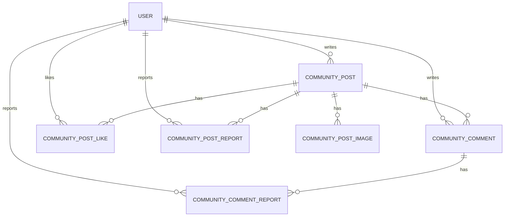

# Rolling 커뮤니티 기능 기획 초안

## 1. 목적과 범위

Rolling의 커뮤니티 기능은 오픈매트와 대회 정보를 소비하던 사용자가 앱 안에서 주짓수 수련 경험을 공유하고, 질문하고, 피드백을 받을 수 있게 만드는 기능이다.

1차 목표는 범용 SNS가 아니라 주짓수 수련자에게 필요한 정보 교환 공간을 만드는 것이다. 따라서 MVP에서는 게시글, 댓글, 좋아요, 신고, 기본 이미지 첨부까지만 제공하고, DM, 실시간 채팅, 영상 피드, 랭킹형 소셜 기능은 이후 단계로 미룬다.

커뮤니티는 오픈매트와 다른 신원 노출 기준을 가진다. 오픈매트와 대회에서는 기존 `User.nickname`을 사용하고, 커뮤니티 게시글과 댓글에서는 별도의 `User.communityNickname`을 사용한다.

## 2. 핵심 기능 및 카테고리 정의

### 2.1 MVP 핵심 기능

- 게시글 작성, 조회, 수정, 삭제
- 카테고리별 게시글 목록 조회
- 제목/본문 기반 게시글 검색
- 댓글 작성, 조회, 수정, 삭제
- 게시글 좋아요 추가/취소
- 게시글 신고
- 댓글 신고
- 작성자 기준 내 게시글 목록 조회
- 이미지 첨부

### 2.2 카테고리 초안

| 카테고리 | enum 후보 | 목적 | 예시 |
| --- | --- | --- | --- |
| 자유 게시판 | `FREE` | 수련 일상, 잡담, 가벼운 정보 공유 | 오늘 오픈매트 후기, 수련 루틴 공유 |
| 기술 질문 | `TECHNIQUE_QNA` | 기술 디테일 질문과 답변 | 암바 방어가 계속 뚫리는 이유 |
| 도장 정보 | `GYM_INFO` | 도장 분위기, 위치, 체험, 수업 정보 공유 | 서울 강남권 노기 수업 있는 도장 |
| 장비/용품 | `GEAR` | 도복, 래시가드, 보호대, 세탁 관리 정보 | 도복 사이즈 추천, 마우스피스 후기 |
| 대회/오픈매트 후기 | `EVENT_REVIEW` | Rolling의 기존 오픈매트/대회 기능과 연결되는 후기 | 지난 주말 대회 운영 후기 |
| 부상/컨디셔닝 | `CONDITIONING` | 부상 예방, 회복, 웨이트, 스트레칭 정보 | 손가락 테이핑, 목 통증 관리 |
| 공지/운영 | `NOTICE` | 관리자 또는 운영자 안내 | 커뮤니티 이용 규칙, 신고 처리 안내 |

### 2.3 MVP 우선순위

| 단계 | 포함 기능 | 제외 기능 |
| --- | --- | --- |
| 지금 | 게시글, 댓글, 좋아요, 신고, 이미지 첨부, 카테고리 필터 | 대댓글, 팔로우, DM, 영상 업로드, 해시태그 |
| 다음 | 대댓글, 인기글, 내가 댓글 단 글, 관리자 숨김 처리 | 실시간 알림, 추천 알고리즘 |
| 나중 | 사용자 팔로우, 영상 피드, 커뮤니티 랭킹, 도장별 소모임 | 범용 SNS 수준의 피드 최적화 |

## 3. 도메인 모델 초안

### 3.1 Entity 구성

### 3.2 `User` 커뮤니티 확장 필드

MVP에서는 커뮤니티 프로필 엔티티를 별도로 만들지 않고 `users` 테이블에 커뮤니티 전용 닉네임만 추가한다.

| 필드 | 타입 | 설명 |
| --- | --- | --- |
| `nickname` | `String` | 오픈매트, 대회, 마이페이지 기본 표시명 |
| `communityNickname` | `String?` | 커뮤니티 게시글/댓글 전용 표시명 |

정책:

- 커뮤니티 게시글과 댓글 작성자명은 `communityNickname`으로 노출한다.
- `communityNickname`이 없으면 게시글/댓글 작성 전에 설정이 필요하다.
- `communityNickname`이 없더라도 비회원/회원의 커뮤니티 목록과 상세 조회는 가능하다.
- 커뮤니티 화면에는 `affiliation`, `email`, `phone`, `socialProvider`를 노출하지 않는다.
- 신고, 차단, 제재는 화면 표시명과 무관하게 내부 `userId` 기준으로 처리한다.
- 프로필 이미지, 소개글, 배지 등은 MVP 범위에서 제외한다.

검증 후보:

- 2자 이상 20자 이하
- 앞뒤 공백 trim
- 공백만 있는 값 불가
- 금칙어 제한
- MVP에서는 중복 닉네임 허용

### 3.3 `CommunityPost`

| 필드 | 타입 | 설명 |
| --- | --- | --- |
| `id` | `Long` | 게시글 ID |
| `author` | `User` | 작성자 |
| `category` | `CommunityPostCategory` | 게시글 카테고리 |
| `title` | `String` | 제목 |
| `content` | `String` | 본문 |
| `viewCount` | `Long` | 조회 수 |
| `likeCount` | `Long` | 좋아요 수 캐시 |
| `commentCount` | `Long` | 댓글 수 캐시 |
| `reportCount` | `Long` | 신고 수 캐시 |
| `status` | `CommunityPostStatus` | 게시글 상태 |
| `createdAt` | `LocalDateTime` | 생성 시각 |
| `updatedAt` | `LocalDateTime` | 수정 시각 |
| `deletedAt` | `LocalDateTime?` | 삭제 시각 |

상태 enum 후보:

- `ACTIVE`: 정상 노출
- `HIDDEN`: 관리자 또는 신고 정책에 의해 숨김
- `DELETED`: 작성자 삭제

### 3.4 `CommunityPostImage`

| 필드 | 타입 | 설명 |
| --- | --- | --- |
| `id` | `Long` | 이미지 ID |
| `post` | `CommunityPost` | 대상 게시글 |
| `imageUrl` | `String` | 공개 이미지 URL |
| `sortOrder` | `Integer` | 노출 순서 |
| `createdAt` | `LocalDateTime` | 생성 시각 |

### 3.5 `CommunityPostLike`

| 필드 | 타입 | 설명 |
| --- | --- | --- |
| `id` | `Long` | 좋아요 ID |
| `post` | `CommunityPost` | 대상 게시글 |
| `user` | `User` | 좋아요한 사용자 |
| `createdAt` | `LocalDateTime` | 생성 시각 |

제약:

- `(post_id, user_id)` unique
- 같은 사용자는 같은 게시글에 한 번만 좋아요 가능

### 3.6 `CommunityPostReport`

| 필드 | 타입 | 설명 |
| --- | --- | --- |
| `id` | `Long` | 신고 ID |
| `post` | `CommunityPost` | 대상 게시글 |
| `reporter` | `User` | 신고한 사용자 |
| `reason` | `ReportReason` | 신고 사유 |
| `customReason` | `String?` | 기타 사유 |
| `status` | `ReportStatus` | 신고 처리 상태 |
| `createdAt` | `LocalDateTime` | 생성 시각 |

### 3.7 `CommunityCommentReport`

| 필드 | 타입 | 설명 |
| --- | --- | --- |
| `id` | `Long` | 신고 ID |
| `comment` | `CommunityComment` | 대상 댓글 |
| `reporter` | `User` | 신고한 사용자 |
| `reason` | `ReportReason` | 신고 사유 |
| `customReason` | `String?` | 기타 사유 |
| `status` | `ReportStatus` | 신고 처리 상태 |
| `createdAt` | `LocalDateTime` | 생성 시각 |

제약:

- `(comment_id, reporter_user_id)` unique
- 같은 사용자는 같은 댓글을 한 번만 신고 가능
- 자기 댓글은 신고 불가

### 3.8 `CommunityComment`

| 필드 | 타입 | 설명 |
| --- | --- | --- |
| `id` | `Long` | 댓글 ID |
| `post` | `CommunityPost` | 대상 게시글 |
| `author` | `User` | 작성자 |
| `content` | `String` | 댓글 본문 |
| `reportCount` | `Long` | 신고 수 캐시 |
| `status` | `CommunityCommentStatus` | 댓글 상태 |
| `createdAt` | `LocalDateTime` | 생성 시각 |
| `updatedAt` | `LocalDateTime` | 수정 시각 |
| `deletedAt` | `LocalDateTime?` | 삭제 시각 |

MVP에서는 대댓글을 제외한다. 이후 확장 시 `parentCommentId`를 nullable로 추가하는 방식이 현실적이다.

## 4. 주요 API 스펙 초안

### 4.1 내 커뮤니티 닉네임 조회

`GET /api/v1/users/me/community-profile`

- 인증: 필요
- 용도: 현재 사용자의 커뮤니티 표시명 조회

Response data:

| 필드 | 타입 | 설명 |
| --- | --- | --- |
| `communityNickname` | `String?` | 커뮤니티 전용 닉네임 |

### 4.2 내 커뮤니티 닉네임 수정

`PATCH /api/v1/users/me/community-profile`

- 인증: 필요
- 용도: 커뮤니티 전용 닉네임 설정 또는 변경

Request body:

| 필드 | 타입 | 필수 | 설명 |
| --- | --- | --- | --- |
| `communityNickname` | `String` | O | 커뮤니티 게시글/댓글에 노출할 닉네임 |

Response data:

| 필드 | 타입 | 설명 |
| --- | --- | --- |
| `communityNickname` | `String` | 변경된 커뮤니티 전용 닉네임 |

검증:

- 2자 이상 20자 이하
- 앞뒤 공백은 trim 후 저장
- 공백만 있는 값은 `VALIDATION_ERROR`
- 금칙어가 있으면 `VALIDATION_ERROR`
- MVP에서는 중복 닉네임을 허용한다.

### 4.3 게시글 목록 조회

`GET /api/v1/community/posts`

- 인증: 선택
- 비회원: 가능
- 용도: 커뮤니티 게시글 목록 조회

Query parameters:

| 파라미터 | 타입 | 기본값 | 설명 |
| --- | --- | --- | --- |
| `category` | `String` | - | 카테고리 필터 |
| `q` | `String` | - | 제목/본문 검색어 |
| `page` | `Integer` | `0` | 페이지 번호 |
| `size` | `Integer` | `20` | 페이지 크기 |
| `sort` | `String` | `createdAt,desc` | 정렬 |

Response: 페이징된 `CommunityPostSummary`

목록 응답 필드:

| 필드 | 타입 | 설명 |
| --- | --- | --- |
| `id` | `Long` | 게시글 ID |
| `category` | `String` | 카테고리 |
| `title` | `String` | 제목 |
| `authorNickname` | `String` | 작성자의 `communityNickname` |
| `likeCount` | `Long` | 좋아요 수 |
| `commentCount` | `Long` | 댓글 수 |
| `viewCount` | `Long` | 조회 수 |
| `createdAt` | `DateTime` | 생성 시각 |

### 4.4 게시글 상세 조회

`GET /api/v1/community/posts/{id}`

- 인증: 선택
- 비회원: 가능
- 용도: 게시글 상세 조회

Response: `CommunityPostDetail`

상세 응답 추가 필드:

| 필드 | 타입 | 설명 |
| --- | --- | --- |
| `content` | `String` | 본문 |
| `images` | `List<CommunityPostImageResponse>` | 이미지 목록 |
| `likeCount` | `Long` | 좋아요 수 |
| `likedByMe` | `Boolean` | 로그인 사용자가 좋아요했는지 여부 |
| `editableByMe` | `Boolean` | 로그인 사용자가 수정/삭제 가능한지 여부 |

비로그인 사용자는 `likedByMe=false`, `editableByMe=false`로 응답한다.
일반 사용자 응답에는 작성자 내부 ID를 기본 노출하지 않는다. 차단 등 사용자 액션에 내부 ID가 필요하면 별도 식별자 노출 정책을 다시 결정한다.

### 4.5 게시글 작성

`POST /api/v1/community/posts`

- 인증: 필요
- 비회원: 불가
- 선행 조건: 현재 사용자의 `communityNickname` 설정 필요

Request body:

| 필드 | 타입 | 필수 | 설명 |
| --- | --- | --- | --- |
| `category` | `String` | O | 카테고리 |
| `title` | `String` | O | 제목 |
| `content` | `String` | O | 본문 |
| `imageUrls` | `List<String>` | - | 첨부 이미지 URL 목록 |

Response: `CommunityPostDetail`

검증:

- 제목은 2자 이상 80자 이하
- 본문은 10자 이상 5000자 이하
- 이미지는 최대 5장
- 이미지 URL은 http/https 공개 URL이어야 한다.
- 허용된 public base URL로 시작해야 한다.
- 허용된 카테고리 enum만 사용 가능

### 4.6 게시글 수정

`PUT /api/v1/community/posts/{id}`

- 인증: 필요
- 권한: 작성자 또는 관리자

Request body:

| 필드 | 타입 | 필수 | 설명 |
| --- | --- | --- | --- |
| `category` | `String` | - | 카테고리 |
| `title` | `String` | - | 제목 |
| `content` | `String` | - | 본문 |
| `imageUrls` | `List<String>` | - | 전체 교체할 이미지 URL 목록 |

Response: `CommunityPostDetail`

정책:

- 수정 요청은 전체 교체 방식으로 단순화한다.
- 최소 1개 필드는 전달해야 한다.
- 작성자가 아니면 `FORBIDDEN` 또는 `NOT_FOUND` 처리 기준을 별도 결정해야 한다.
- 수정 시 이미지 목록은 전체 교체 방식으로 저장한다.

### 4.7 게시글 삭제

`DELETE /api/v1/community/posts/{id}`

- 인증: 필요
- 권한: 작성자 또는 관리자
- Response data: `null`

정책:

- 물리 삭제가 아니라 soft delete로 처리한다.
- 삭제된 게시글은 일반 목록과 상세에서 조회되지 않는다.
- 관리자 화면에서는 삭제 상태와 삭제 시각을 확인할 수 있게 한다.

### 4.8 댓글 목록 조회

`GET /api/v1/community/posts/{postId}/comments`

- 인증: 선택
- 비회원: 가능

Query parameters:

| 파라미터 | 타입 | 기본값 |
| --- | --- | --- |
| `page` | `Integer` | `0` |
| `size` | `Integer` | `50` |
| `sort` | `String` | `createdAt,asc` |

Response: 페이징된 `CommunityCommentResponse`

### 4.9 댓글 작성

`POST /api/v1/community/posts/{postId}/comments`

- 인증: 필요
- 비회원: 불가
- 선행 조건: 현재 사용자의 `communityNickname` 설정 필요

Request body:

| 필드 | 타입 | 필수 |
| --- | --- | --- |
| `content` | `String` | O |

Response: `CommunityCommentResponse`

검증:

- 댓글은 1자 이상 1000자 이하
- 삭제되거나 숨김 처리된 게시글에는 댓글 작성 불가

### 4.10 댓글 수정

`PUT /api/v1/community/comments/{commentId}`

- 인증: 필요
- 권한: 작성자 또는 관리자

Request body:

| 필드 | 타입 | 필수 |
| --- | --- | --- |
| `content` | `String` | O |

Response: `CommunityCommentResponse`

### 4.11 댓글 삭제

`DELETE /api/v1/community/comments/{commentId}`

- 인증: 필요
- 권한: 작성자 또는 관리자
- Response data: `null`

### 4.12 게시글 좋아요

`POST /api/v1/community/posts/{id}/like`

- 인증: 필요
- 비회원: 불가
- Response data: `null`

정책:

- 이미 좋아요한 게시글이면 idempotent하게 성공 처리하거나 `ALREADY_LIKED`를 반환할 수 있다.
- Flutter UX 단순화를 위해 MVP에서는 재요청 성공 처리 방식이 더 안정적이다.

### 4.13 게시글 좋아요 취소

`DELETE /api/v1/community/posts/{id}/like`

- 인증: 필요
- 비회원: 불가
- Response data: `null`

정책:

- 좋아요하지 않은 상태에서 취소 요청이 와도 성공 처리한다.

### 4.14 게시글 신고

`POST /api/v1/community/posts/{id}/report`

- 인증: 필요
- 비회원: 불가

Request body:

| 필드 | 타입 | 필수 | 설명 |
| --- | --- | --- | --- |
| `reason` | `String` | O | `FALSE_INFO`, `INAPPROPRIATE`, `SPAM`, `OTHER` |
| `customReason` | `String?` | - | `OTHER` 선택 시 필수 |

Response data: `null`

에러:

- `ALREADY_REPORTED`
- `SELF_REPORT_NOT_ALLOWED`
- `VALIDATION_ERROR`
- `NOT_FOUND`

### 4.15 댓글 신고

`POST /api/v1/community/comments/{commentId}/report`

- 인증: 필요
- 비회원: 불가

Request body:

| 필드 | 타입 | 필수 | 설명 |
| --- | --- | --- | --- |
| `reason` | `String` | O | `FALSE_INFO`, `INAPPROPRIATE`, `SPAM`, `OTHER` |
| `customReason` | `String?` | - | `OTHER` 선택 시 필수 |

Response data: `null`

정책:

- 같은 사용자는 같은 댓글을 한 번만 신고할 수 있다.
- 자기 댓글은 신고할 수 없다.
- 삭제되거나 숨김 처리된 댓글은 신고할 수 없다.
- 댓글 신고는 게시글 신고와 별도 집계한다.

에러:

- `ALREADY_REPORTED`
- `SELF_REPORT_NOT_ALLOWED`
- `VALIDATION_ERROR`
- `NOT_FOUND`

### 4.16 내 게시글 목록 조회

`GET /api/v1/community/posts/my`

- 인증: 필요
- 비회원: 불가
- 용도: 현재 로그인한 사용자가 작성한 커뮤니티 게시글 목록 조회
- Response: 페이징된 `CommunityPostSummary`

Query parameters:

| 파라미터 | 타입 | 기본값 |
| --- | --- | --- |
| `page` | `Integer` | `0` |
| `size` | `Integer` | `20` |
| `sort` | `String` | `createdAt,desc` |

## 5. 고려해야 할 정책 및 예외 상황

### 5.1 이미지 첨부 정책

- MVP에서는 게시글당 최대 5장까지 허용한다.
- 게시글 저장 API는 이미지 바이너리가 아니라 업로드 완료된 URL 목록을 받는다.
- 이미지 URL은 `http` 또는 `https` 공개 URL이어야 한다.
- 이미지 경로의 확장자는 `jpg`, `jpeg`, `png`, `webp`, `gif`, `bmp`, `svg`, `avif`, `ico`를 허용한다.
- Rolling이 허용한 public base URL 설정이 있으면 해당 base URL로 시작하는지 추가 검증한다.
- 이미지는 상세 응답의 `images`에만 포함하고, 목록 응답에는 포함하지 않는다.

### 5.2 삭제 정책

- 게시글과 댓글은 soft delete를 기본으로 한다.
- 삭제된 게시글은 일반 목록과 상세에서 `NOT_FOUND`로 처리한다.
- 삭제된 게시글의 댓글은 일반 사용자에게 노출하지 않는다.
- 작성자가 탈퇴해도 게시글 처리 정책은 별도 결정이 필요하다. MVP 권장안은 작성자 닉네임을 `탈퇴한 사용자`로 마스킹하고 콘텐츠는 유지하는 방식이다.

### 5.3 신고 및 숨김 정책

- 같은 사용자는 같은 게시글을 한 번만 신고할 수 있다.
- 같은 사용자는 같은 댓글을 한 번만 신고할 수 있다.
- 자기 게시글은 신고할 수 없다.
- 자기 댓글은 신고할 수 없다.
- 신고 1건만으로 자동 숨김 처리하지 않는다.
- 현재 구현은 신고 누적과 중복 신고 차단까지만 포함하고, 자동 숨김과 관리자 검토 목록은 Phase 6에서 다룬다.
- 게시글 신고와 댓글 신고는 대상이 다르므로 별도 집계하고 별도 운영 조치한다.
- 커뮤니티는 오픈매트와 달리 즉시 신청 차단 같은 거래성 기능이 없으므로 자동 숨김은 신중하게 적용한다.

### 5.4 권한 정책

- 커뮤니티 작성 권한은 로그인 사용자에게만 부여한다.
- 게시글/댓글 작성 전 `communityNickname`이 없으면 `COMMUNITY_NICKNAME_REQUIRED`로 거절한다.
- 게시글과 댓글 수정/삭제는 작성자 또는 관리자만 가능하다.
- 일반 사용자는 다른 사용자의 신고 수, 신고자, 운영 처리 상태를 볼 수 없다.
- 정지 계정은 커뮤니티 작성, 댓글, 좋아요, 신고 기능을 제한하는 방향이 안전하다.
- 비로그인 사용자는 목록과 상세 조회만 가능하게 한다.

### 5.5 비회원 커뮤니티 이용 정책

비회원은 커뮤니티를 둘러볼 수는 있지만, 계정 기반 행위는 할 수 없다.

비회원 가능 기능:

- 게시글 목록 조회
- 게시글 상세 조회
- 댓글 목록 조회
- 게시글 이미지 보기
- 카테고리 필터
- 제목/본문 검색

비회원 불가 기능:

- 커뮤니티 닉네임 설정
- 게시글 작성
- 게시글 수정/삭제
- 댓글 작성
- 댓글 수정/삭제
- 게시글 좋아요/좋아요 취소
- 게시글 신고
- 댓글 신고
- 사용자 차단
- 내 게시글 목록 조회

정책:

- 비회원이 제한 기능을 누르면 로그인 필요 안내를 보여준다.
- 로그인 후 `communityNickname`이 없으면 커뮤니티 닉네임 설정을 먼저 완료해야 한다.
- 커뮤니티 공개 조회 요청은 App Review 둘러보기 정책과 동일하게 `Authorization` 헤더 없이 호출할 수 있다.
- 비회원 조회에는 개인화 차단 필터, `likedByMe`, `editableByMe` 같은 사용자 기준 상태를 적용하지 않는다.

### 5.6 커뮤니티 닉네임 정책

- 오픈매트와 대회는 기존 `User.nickname`을 계속 사용한다.
- 커뮤니티 게시글과 댓글은 `User.communityNickname`을 사용한다.
- `communityNickname`은 커뮤니티 전용 표시명이며, 사용자 기본 닉네임과 독립적으로 변경할 수 있다.
- 커뮤니티 응답에는 `affiliation`, `email`, `phone`, `socialProvider`를 포함하지 않는다.
- 일반 사용자 응답에는 내부 `userId`를 기본 노출하지 않는다.
- 신고, 차단, 제재, 작성자 권한 검사는 표시명이 아니라 내부 `userId`로 처리한다.
- 커뮤니티 닉네임 변경 이력과 변경 주기 제한은 MVP에서는 제외하고, 운영 이슈가 생기면 추가한다.

### 5.7 사용자 차단 정책

- 기존 사용자 차단 정책과 일관되게, 차단한 작성자의 게시글은 목록과 상세에서 숨긴다.
- 차단한 사용자의 댓글도 댓글 목록에서 숨긴다.
- 차단 필터는 로그인 사용자에게만 적용된다.
- 비로그인 사용자는 개인화 차단 필터 없이 공개 콘텐츠를 조회한다.

### 5.8 알림 정책

- MVP에서는 댓글 작성 시 게시글 작성자에게 앱 내 알림을 저장하는 것을 권장한다.
- 좋아요 알림은 노이즈가 커질 수 있으므로 MVP에서는 제외한다.
- 댓글 알림은 FCM 성공 여부와 별개로 DB `Notification` 저장을 source of truth로 삼는다.
- 본인이 자기 게시글에 댓글을 단 경우 알림을 생성하지 않는다.

### 5.9 운영자 기능

- 관리자 게시글 목록 조회
- 관리자 게시글 상세 조회
- 관리자 게시글 숨김/숨김 해제
- 관리자 댓글 숨김/숨김 해제
- 게시글 신고 목록 조회와 상태 변경
- 댓글 신고 목록 조회와 상태 변경
- 운영 메모 저장

MVP 사용자 앱 출시 전에 최소한 숨김 처리와 신고 확인 경로는 있어야 한다. 커뮤니티는 사용자 생성 콘텐츠가 중심이므로 운영 도구 없이 출시하면 리스크가 크다.

### 5.10 예외 상황

| 상황 | 권장 처리 |
| --- | --- |
| 존재하지 않는 게시글 조회 | `NOT_FOUND` |
| 삭제된 게시글 조회 | `NOT_FOUND` |
| 숨김 처리된 게시글 조회 | 일반 사용자 `NOT_FOUND`, 관리자 조회 가능 |
| 비회원의 작성/댓글/좋아요/신고/차단 | `UNAUTHORIZED` 또는 로그인 필요 안내 |
| 작성자가 아닌 사용자의 수정/삭제 | `FORBIDDEN` |
| 중복 좋아요 | 성공 처리 또는 `ALREADY_LIKED`; MVP 권장안은 성공 처리 |
| 좋아요하지 않은 상태에서 취소 | 성공 처리 |
| 중복 게시글 신고 | `ALREADY_REPORTED` |
| 중복 댓글 신고 | `ALREADY_REPORTED` |
| 자기 게시글 신고 | `SELF_REPORT_NOT_ALLOWED` |
| 자기 댓글 신고 | `SELF_REPORT_NOT_ALLOWED` |
| 허용되지 않은 이미지 URL | `VALIDATION_ERROR` |
| 커뮤니티 닉네임 없이 작성/댓글 | `COMMUNITY_NICKNAME_REQUIRED` |
| 커뮤니티 닉네임 검증 실패 | `VALIDATION_ERROR` |
| 정지 계정의 작성/댓글 | `ACCOUNT_RESTRICTED` |

## 6. 수용 기준

- 사용자는 카테고리별 게시글 목록을 최신순으로 조회할 수 있다.
- 로그인 사용자는 커뮤니티 전용 닉네임을 설정하고 변경할 수 있다.
- 커뮤니티 닉네임이 없는 로그인 사용자는 게시글/댓글 작성 전에 설정이 필요하다.
- 로그인 사용자는 게시글을 작성, 수정, 삭제할 수 있다.
- 로그인 사용자는 댓글을 작성, 수정, 삭제할 수 있다.
- 로그인 사용자는 게시글 좋아요를 추가하고 취소할 수 있다.
- 로그인 사용자는 부적절한 게시글을 신고할 수 있다.
- 로그인 사용자는 부적절한 댓글을 신고할 수 있다.
- 작성자와 관리자가 아닌 사용자는 게시글과 댓글을 수정하거나 삭제할 수 없다.
- 차단한 사용자의 게시글과 댓글은 로그인 사용자 기준으로 숨겨진다.
- 삭제 또는 숨김 처리된 게시글은 일반 사용자에게 노출되지 않는다.
- 게시글 목록 조회에서 작성자 커뮤니티 닉네임, 좋아요 수, 댓글 수가 일관되게 반환된다.
- 커뮤니티 응답에는 소속, 이메일, 전화번호, 소셜 provider가 노출되지 않는다.

## 7. 성공 신호

- 커뮤니티 탭 방문 사용자 중 게시글 상세 진입률
- 커뮤니티 닉네임 설정 완료율
- 게시글 작성 사용자 수
- 댓글 작성 사용자 수
- 게시글당 평균 댓글 수
- 신고된 게시글 비율
- 신고된 댓글 비율
- 신고 처리까지 걸린 평균 시간
- 오픈매트/대회 후기 카테고리에서 기존 기능으로 재진입하는 비율

## 8. 미해결 의사결정 항목

| 항목 | 권장안 | 결정 필요자 |
| --- | --- | --- |
| 신고 3건 이상 자동 숨김 여부 | MVP에서는 게시글/댓글 모두 자동 숨김 대신 관리자 검토 우선 | 제품/운영 |
| 작성자 탈퇴 후 게시글 유지 여부 | 닉네임 마스킹 후 콘텐츠 유지 | 제품/운영 |
| 커뮤니티 닉네임 변경 주기 제한 | MVP에서는 제한 없음 | 제품 |
| 커뮤니티 닉네임 중복 허용 여부 | MVP에서는 중복 허용 | 제품/백엔드 |
| 댓글 알림 FCM 발송 여부 | DB 알림 저장은 포함, FCM은 설정 기반 발송 | 제품/백엔드 |
| 대댓글 포함 여부 | MVP 제외 | 제품 |
| 인기글 기준 | MVP 제외, 데이터 수집 후 결정 | 제품 |
| 관리자 웹 구현 범위 | 숨김/신고 처리 최소 포함 | 제품/프론트/백엔드 |

## 9. Phase별 실행 체크리스트

### Phase 0. 외부 결정 및 운영 준비

이 단계는 코드 구현 전에 제품/운영자가 먼저 결정해야 하는 항목이다. 결정되지 않으면 구현은 가능해도 출시 직전 정책 충돌이 생길 수 있다.

- [x] 커뮤니티 카테고리 최종 확정
- [x] 카테고리별 앱 노출 이름 확정
- [ ] 커뮤니티 이용 규칙 문구 작성 - 커뮤니티 기능이 생긴 후 추가할 예정
- [ ] 신고 사유 문구와 사용자 노출 문구 확정 - 커뮤니티 기능이 생긴 후 추가할 예정
- [ ] 금칙어 1차 목록 작성 - 커뮤니티 기능이 생긴 후 추가할 예정
- [x] 커뮤니티 닉네임 중복 허용 정책 최종 확정 - 내용대로 진행
- [x] 커뮤니티 닉네임 변경 주기 제한 여부 최종 확정 - 변경주기 1일 
- [x] 신고 3건 이상 자동 숨김 여부 최종 확정 - 내용대로 진행
- [x] 작성자 탈퇴 후 게시글 유지/마스킹 정책 최종 확정 - 내용대로 진행
- [x] 운영자가 신고/숨김 처리를 볼 관리자 화면 최소 범위 확정 - react admin 페이지
- [ ] App Review 비회원 둘러보기에서 커뮤니티 읽기 전용 노출 여부 확정 - 비회원은 둘러보기만 보기만 가능
- [ ] 비회원 제한 기능 클릭 시 로그인 유도 문구 확정 - 내용대로 진행
- [ ] 커뮤니티 출시 전 초기 게시글 또는 공지 콘텐츠 준비 - 공지는 기능이 생긴 후 추가할 예정  

완료 기준:

- MVP 구현 중 바뀌면 안 되는 정책이 문서에 확정 상태로 반영되어 있다.
- 운영자가 신고와 숨김 처리를 어떤 화면에서 처리할지 결정되어 있다.

### Phase 1. 백엔드 기반 작업

- [x] `users` 테이블에 `community_nickname` 컬럼 추가
- [x] `User` entity에 `communityNickname` 필드 추가
- [x] `/api/v1/users/me/community-profile` 조회 API 구현
- [x] `/api/v1/users/me/community-profile` 수정 API 구현
- [x] 커뮤니티 닉네임 validation 구현
- [x] `COMMUNITY_NICKNAME_REQUIRED` 에러 코드 추가
- [x] 커뮤니티 닉네임 없이 게시글/댓글 작성 시 차단하는 공통 검증 추가
- [x] 커뮤니티 응답에서 `affiliation`, `email`, `phone`, `socialProvider` 미노출 보장
- [x] 커뮤니티 응답에서 일반 사용자에게 내부 `userId`를 기본 노출하지 않도록 DTO 설계
- [x] 커뮤니티 카테고리 enum 추가
- [x] 게시글/댓글 상태 enum 추가

완료 기준:

- 로그인 사용자는 커뮤니티 닉네임을 조회/수정할 수 있다.
- 커뮤니티 닉네임이 없는 사용자는 작성 API에서 명확한 에러를 받는다.
- 오픈매트와 대회는 기존 `User.nickname` 동작을 유지한다.

### Phase 2. 게시글 MVP

- [x] `CommunityPost` entity 추가
- [x] 게시글 repository 추가
- [x] 게시글 생성 API 구현
- [x] 게시글 목록 조회 API 구현
- [x] 게시글 상세 조회 API 구현
- [x] 게시글 수정 API 구현
- [x] 게시글 삭제 soft delete 구현
- [x] 카테고리 필터 구현
- [x] 제목/본문 검색 구현
- [x] 페이징과 최신순 정렬 구현
- [x] 작성자 권한 검증 구현
- [x] 삭제/숨김 게시글 일반 사용자 `NOT_FOUND` 처리
- [x] 게시글 목록/상세 DTO에 `communityNickname` 기반 작성자명 반영

완료 기준:

- 비회원과 로그인 사용자는 게시글 목록/상세를 조회할 수 있다.
- 로그인 사용자 중 커뮤니티 닉네임이 있는 사용자만 게시글을 작성할 수 있다.
- 작성자 또는 관리자만 게시글을 수정/삭제할 수 있다.

### Phase 3. 댓글 MVP

- [x] `CommunityComment` entity 추가
- [x] 댓글 repository 추가
- [x] 댓글 목록 조회 API 구현
- [x] 댓글 작성 API 구현
- [x] 댓글 수정 API 구현
- [x] 댓글 삭제 soft delete 구현
- [x] 게시글 삭제/숨김 상태에서 댓글 작성 차단
- [x] 댓글 작성자 권한 검증 구현
- [x] 게시글 `commentCount` 캐시 갱신 정책 구현
- [x] 댓글 DTO에 `communityNickname` 기반 작성자명 반영

완료 기준:

- 게시글 상세에서 댓글 목록을 조회할 수 있다.
- 로그인 사용자 중 커뮤니티 닉네임이 있는 사용자만 댓글을 작성할 수 있다.
- 작성자 또는 관리자만 댓글을 수정/삭제할 수 있다.

### Phase 4. 좋아요, 신고, 차단 연동

- [x] `CommunityPostLike` entity 추가
- [x] 게시글 좋아요 API 구현
- [x] 게시글 좋아요 취소 API 구현
- [x] 중복 좋아요 idempotent 처리
- [x] 게시글 `likeCount` 캐시 갱신 정책 구현
- [x] `CommunityPostReport` entity 추가
- [x] 게시글 신고 API 구현
- [x] `CommunityCommentReport` entity 추가
- [x] 댓글 신고 API 구현
- [x] 중복 신고 차단
- [x] 자기 게시글/댓글 신고 차단
- [x] 삭제/숨김 게시글과 댓글 신고 차단
- [ ] 신고 누적 3건 이상 관리자 검토 대상 표시
- [ ] 기존 사용자 차단 정책을 커뮤니티 게시글 목록/상세에 적용
- [ ] 기존 사용자 차단 정책을 댓글 목록에 적용
- [x] 정지 계정의 작성/댓글/좋아요/신고 제한 적용

완료 기준:

- 좋아요는 중복 요청에도 사용자 경험이 깨지지 않는다.
- 게시글과 댓글 신고가 별도 집계된다.
- 차단한 사용자의 게시글과 댓글은 로그인 사용자 기준으로 숨겨진다.

### Phase 5. 이미지 첨부

- [x] `CommunityPostImage` entity 추가
- [x] 게시글 이미지 URL 저장 구현
- [x] 이미지 최대 5장 제한 구현
- [x] 허용 확장자 검증 구현
- [x] 허용 S3/CDN base URL 검증 구현
- [x] 게시글 수정 시 이미지 목록 전체 교체 정책 구현
- [x] 게시글 상세에서 이미지만 응답
- [x] 이미지가 없는 게시글의 응답 fallback 정의

완료 기준:

- 게시글 작성/수정 시 이미지 URL 목록을 저장할 수 있다.
- 게시글 목록에는 이미지 URL이 내려가지 않는다.
- 허용되지 않은 이미지 URL은 저장되지 않는다.

### Phase 6. 운영자 기능

- [x] 관리자 게시글 목록 조회 API 구현
- [x] 관리자 게시글 상세 조회 API 구현
- [x] 관리자 게시글 숨김 API 구현
- [x] 관리자 게시글 숨김 해제 API 구현
- [x] 관리자 댓글 숨김 API 구현
- [x] 관리자 댓글 숨김 해제 API 구현
- [x] 관리자 게시글 신고 목록 조회 API 구현
- [x] 관리자 댓글 신고 목록 조회 API 구현
- [x] 신고 상태 변경 API 구현
- [x] 운영 메모 저장 여부 결정 및 구현
- [x] 관리자 API `ROLE_ADMIN` 권한 검증 테스트 추가

완료 기준:

- 운영자는 신고된 게시글과 댓글을 확인할 수 있다.
- 운영자는 부적절한 게시글과 댓글을 숨김 처리할 수 있다.
- 관리자 API는 일반 사용자 accessToken으로 접근할 수 없다.

### Phase 7. 알림 및 사용자 경험 보강

- [x] 댓글 작성 시 게시글 작성자에게 앱 내 알림 저장
- [x] 자기 게시글에 직접 댓글을 단 경우 알림 미생성
- [x] 커뮤니티 알림 타입 추가
- [x] 알림 route 정책 정의
- [x] FCM 발송 여부와 DB 알림 저장 책임 분리
- [ ] 커뮤니티 닉네임 미설정 사용자의 작성 진입 UX 정의
- [ ] 비회원 사용자의 작성/댓글/좋아요/신고/차단 진입 UX 정의
- [ ] 비회원 조회 요청에서 `Authorization` 헤더를 붙이지 않는 App Review 흐름 확인
- [ ] 삭제/숨김 콘텐츠 접근 시 사용자 메시지 정의

완료 기준:

- 댓글 알림은 DB `Notification` 저장을 source of truth로 동작한다.
- 비회원과 닉네임 미설정 사용자는 막히는 이유와 다음 행동을 알 수 있다.

### Phase 8. Flutter 앱 연동

- [ ] 커뮤니티 탭 추가
- [ ] 카테고리 필터 UI 구현
- [ ] 게시글 목록 화면 구현
- [ ] 게시글 상세 화면 구현
- [ ] 커뮤니티 닉네임 설정 화면 구현
- [ ] 게시글 작성/수정 화면 구현
- [ ] 댓글 목록/작성/수정/삭제 UI 구현
- [ ] 좋아요 UI 구현
- [ ] 게시글 신고 UI 구현
- [ ] 댓글 신고 UI 구현
- [ ] 비회원 조회와 로그인 필요 안내 분기 구현
- [ ] 비회원은 게시글 목록/상세/댓글 목록만 사용 가능하도록 액션 버튼 분기 구현
- [ ] 커뮤니티 응답의 `communityNickname` 표시 확인
- [ ] 소속, 이메일, 전화번호가 노출되지 않는지 UI 확인

완료 기준:

- 비회원은 커뮤니티 목록과 상세를 조회할 수 있다.
- 로그인 사용자는 닉네임 설정 후 글과 댓글을 작성할 수 있다.
- 신고와 좋아요 동작 후 화면 상태가 일관되게 갱신된다.

### Phase 9. 테스트와 출시 준비

- [ ] 커뮤니티 닉네임 조회/수정 테스트
- [ ] 게시글 CRUD 테스트
- [ ] 댓글 CRUD 테스트
- [ ] 좋아요 중복 요청 테스트
- [ ] 게시글 신고 중복/자기 신고 테스트
- [ ] 댓글 신고 중복/자기 신고 테스트
- [ ] 작성자 권한 테스트
- [ ] 관리자 권한 테스트
- [ ] 차단 사용자 게시글/댓글 필터 테스트
- [ ] 정지 계정 제한 테스트
- [ ] 비회원 조회 테스트
- [ ] 삭제/숨김 콘텐츠 `NOT_FOUND` 처리 테스트
- [ ] 이미지 첨부 validation 테스트
- [ ] N+1 쿼리 위험 구간 점검
- [ ] 커뮤니티 출시 전 운영자 신고 처리 플로우 리허설
- [ ] 출시 후 확인할 성공 신호 대시보드 또는 수동 집계 방식 준비

완료 기준:

- 핵심 사용자 경로와 운영자 경로가 테스트로 검증되어 있다.
- 출시 후 신고 처리와 사용자 문의 대응 기준이 준비되어 있다.

### Phase 10. 출시 이후 개선 후보

- [ ] 대댓글 도입 여부 검토
- [ ] 인기글 기준 검토
- [ ] 내가 댓글 단 글 목록 검토
- [ ] 커뮤니티 닉네임 변경 주기 제한 검토
- [ ] 금칙어 자동화 수준 확대 검토
- [ ] 신고 자동 숨김 정책 재검토
- [ ] 좋아요 알림 도입 여부 검토
- [ ] 커뮤니티 프로필 분리 여부 검토
- [ ] 프로필 이미지, 소개글, 배지 도입 여부 검토
- [ ] 오픈매트/대회 후기와 기존 기능 간 딥링크 강화 검토

완료 기준:

- MVP 사용 데이터와 신고/운영 비용을 보고 다음 투자 범위를 결정한다.
- 활성화에 도움이 되는 기능과 운영 리스크를 키우는 기능을 분리해서 판단한다.
