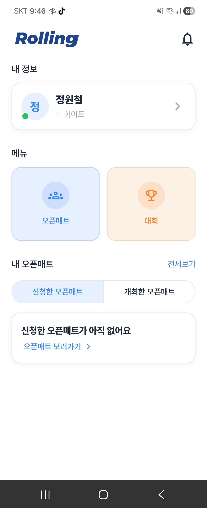
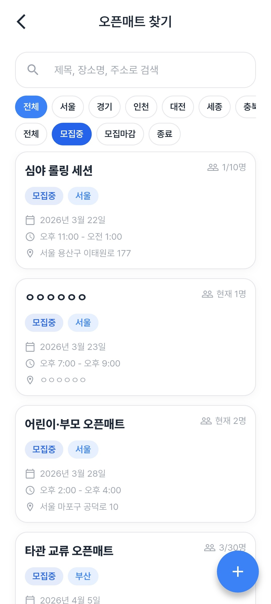
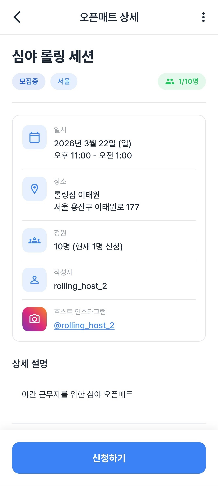

# 화면 미리보기

[README로 돌아가기](../README.md)

README의 썸네일을 클릭하면 이 문서의 각 섹션으로 이동합니다.

## 사용자 화면

| 로그인 | 메인 페이지 |
| :---: | :---: |
|  |  |

| 오픈매트 목록 | 오픈매트 신청 |
| :---: | :---: |
|  |  |

| 개최한 오픈매트 | 대회 목록 |
| :---: | :---: |
|  |  |

## 관리자 화면

### 운영 대시보드

### 신고 관리

### 문의 관리

### 문의 답변

### 공지사항 관리

### 공지사항 작성

### 대회 운영

### 대회 수동 등록

### 대회 크롤링 실행

